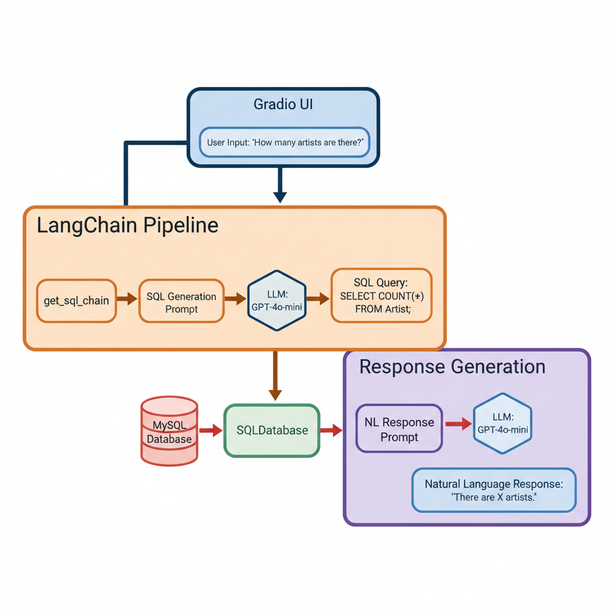

# 💬 Chat with MySQL using GPT-4 + LangChain + Gradio

This project is an **AI-powered SQL assistant** that lets you chat with your MySQL database in **plain English**.
It uses **OpenAI’s GPT-4**, LangChain, and Gradio to translate natural language into SQL queries, execute them on a database, and return human-friendly answers.

---

## ✨ Features

-   **Natural Language → SQL**: Ask questions like _“What are the top 5 longest tracks?”_ and get SQL + results.
-   **Automatic Query Execution**: Generated SQL is executed directly against your MySQL database.
-   **Smart Explanations**: Returns results in **natural language**, not just raw tables.
-   **Interactive UI**: Built with Gradio, featuring a sidebar for DB settings and a sleek chat interface.
-   **Logging Support**: SQL queries, user requests, and errors are logged to `chat_with_mysql.log`.

Consider the following diagram to understand how the Chatbot Structure is built:



## Installation
Ensure you have Python installed on your machine also ensure proper MySQL installation along with a database of your choice that you will chat with. Then clone this repository:

```bash
git clone [repository-link]
cd [repository-directory]
```

## 2. Install dependencies

```bash
pip install -r requirements.txt
```

## Create your own .env file with the necessary variables, including your OpenAI API key:

```bash
OPENAI_API_KEY=[your-openai-api-key]
```

## ▶️ Usage
Run the Gradio app

```bash
python chatbot.py
```

## Access the app
Gradio will display a local URL, e.g.:

```bash
Running on local URL: [http://127.0.0.1:7860](http://127.0.0.1:7860)
With share=True, you’ll also get a temporary public link.
```
## ⚙️ Configuration
Database Settings can be entered in the Gradio UI (host, port, username, password, DB name).

Defaults assume the Chinook sample database, and the default user is listed as root.

## 📝 Logging
All queries and errors are logged to chat_with_mysql.log

## License
This project is licensed under the MIT License - see the LICENSE file for details.

---
